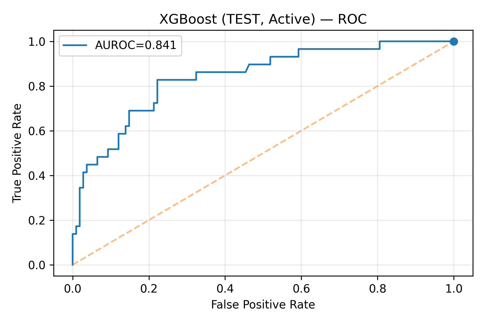

# Asthma Exacerbation Prediction from Wearable Heart Rate

End-to-end, modular ML pipeline that compares **passive** (wearable-only) and **active** (wearable + patient-reported/inhaler) feature sets to predict impending asthma exacerbations. The repository contains a reproducible notebook, a small utilities package in `src/`, plotting helpers under `src/viz/`, and an HTML case-study summary.

- 📄 **Dissertation report** available upon request.
- 🧪 **Notebook**: `asthma_exacerbation_wearables.ipynb`
- 🌐 **HTML case study**:
  - Direct (relative): [index.html](index.html)
  - One-click viewer (recommended if browsing on GitHub):  
    https://htmlpreview.github.io/?https://raw.githubusercontent.com/cianmcguinn/asthma-exacerbation-wearables/main/index.html  
  - (Optional) GitHub Pages: `https://cianmcguinn.github.io/asthma-exacerbation-wearables/index.html` (enable Pages if you want this URL to work)

---

## Contents

```
.
├── src/
│   ├── config.py          # centralised run/config knobs (seeds, paths, windows, thresholds)
│   ├── data_io.py         # loading, caching, basic cleaning
│   ├── temporal.py        # rolling windows, lookback/horizon utilities
│   ├── features.py        # wearable/active feature engineering (HR/HRV, usage bins, aggregates)
│   ├── outcomes.py        # outcome labelling, buffers, target definitions
│   ├── splits.py          # subject-level / temporal splits; train/val/test utilities
│   ├── models.py          # training/eval loops (e.g., XGB, LR), metrics
│   ├── reporting.py       # tables/summary assembly
│   └── viz/
│       ├── bars.py        # grouped bar charts (sensitivity analyses etc.)
│       ├── curves.py      # ROC/PR curves
│       ├── events.py      # timeline/event plots
│       ├── shap.py        # SHAP explanations
│       └── html.py        # helpers for HTML outputs
├── asthma_exacerbation_wearables.ipynb  # main, modularised analysis
├── index.html                            # case-study summary (rendered notebook)
├── requirements.txt
├── .gitignore
├── LICENSE
└── README.md
```

---

## What this project does

- **Problem**: Predict near-term asthma exacerbations using consumer-wearable heart-rate signals, and optionally patient-reported data/inhaler usage.
- **Approach**:
  - **Passive pipeline**: features from wearable time series (HR/HRV, circadian bins, rolling aggregates).
  - **Active pipeline**: augments passive features with questionnaire/inhaler-usage signals.
  - **Temporal labelling**: lookback windows and prediction horizons; event buffers to avoid label leakage.
  - **Evaluation**: subject-aware/temporal splits; PR-AUC, ROC-AUC, calibration; sensitivity analyses (alternative definitions/thresholds).
  - **Explainability**: SHAP-based feature attributions; curve/threshold visualisations.

> The notebook reads like a report: load → engineer features → define outcomes → split → train/evaluate → sensitivity analyses → plots & tables.

---

## Quickstart

### 1) Environment
```bash
git clone https://github.com/cianmcguinn/asthma-exacerbation-wearables.git
cd asthma-exacerbation-wearables

# (Recommended) create a virtual environment
python -m venv .venv
# Windows:
.venv\Scripts\activate
# macOS/Linux:
source .venv/bin/activate

pip install -r requirements.txt
```

### 2) Data
This repository does **not** include study data. Point the notebook (or `src/config.py`) to your local data location and follow any notes inside `data_io.py`.

### 3) Run the analysis
```bash
jupyter lab  # or: jupyter notebook
```
Open `asthma_exacerbation_wearables.ipynb` and run top-to-bottom. The notebook uses the modules in `src/` for feature generation, splits, training, visualisation, and reporting.

---

## Reproducibility & structure

- **Determinism**: seeds and knobs are centralised in `src/config.py`.
- **Temporal care**: `temporal.py` and `splits.py` implement lookbacks/horizons and subject-aware temporal splits.
- **Sensitivity analysis**: toggle alternative label definitions, completeness thresholds, and windows; results visualised via `src/viz/bars.py` & `curves.py`.
- **Reporting**: `reporting.py` and `viz/` compose tables and publication-style figures used in the HTML case study.

---

## Key modules (at a glance)

- `features.py`: computes wearable features (e.g., resting HR bands, variability, rolling stats) and, in **active** runs, merges patient-reported or inhaler usage features.
- `outcomes.py`: builds labels with buffer rules to avoid leakage around events.
- `models.py`: training wrappers for baseline linear models and gradient-boosting (e.g., XGBoost), metric computation (ROC/PR), optional calibration.
- `splits.py`: person-level and temporal splits for realistic evaluation.
- `viz/`: consistent plotting for ROC/PR, grouped bars, event timelines, SHAP.

---

## Results (high level)

- The code compares **passive** vs **active** signals under consistent temporal splits.
- Metrics include **PR-AUC** and **ROC-AUC**, with plots saved by `viz/`.
- SHAP plots highlight the most influential features in each setting.
- Sensitivity analyses show how performance shifts under alternative outcome and window definitions.

> For a readable narrative with figures, open the **[HTML case study](index.html)**  
> or the one-click viewer:  
> https://htmlpreview.github.io/?https://raw.githubusercontent.com/cianmcguinn/asthma-exacerbation-wearables/main/index.html

---

## Example Outputs

| Active XGBoost (Questionnaire Data) | Passive XGBoost (Heart Rate Data) |
|:----------------------------------:|:---------------------------------:|
|  |  |

| Active Model — SHAP Summary | Passive Model — SHAP Summary |
|:----------------------------:|:-----------------------------:|
|  |  |

> The ROC curves show the discriminative ability of each model (AUROC 0.841 for active, 0.756 for passive).  
> SHAP summary plots highlight the most influential predictors in each case — reliever use and night-time symptoms in active models; HR variability and circadian HR measures in passive models.


## How to extend

- **Add features**: implement in `features.py`, register in the feature set builder.
- **Try a new model**: add to `models.py` with a `fit/predict/evaluate` interface (reuse metrics/viz).
- **New sensitivity axis**: parameterise in `config.py` and pipe through the notebook’s sensitivity section.

---

## Dependencies

See [`requirements.txt`](requirements.txt). Typical stack: Python 3.10+, pandas, numpy, scikit-learn, xgboost, matplotlib, shap, jupyter.

---

## License

This project is released under the license in [`LICENSE`](LICENSE).

---

## Citation

If you reference this work in academic or technical writing, please cite the accompanying dissertation/report (filename in the repo root).

[README (1).md](https://github.com/user-attachments/files/23053117/README.1.md)

